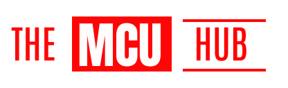

<h3>Description</h3>

The MCU HUB is a Web Application that lets you brows all details of <em>Marvel Cinematic Universe</em> including upcoming movies. The MCU hub is a grate platform for all MCU enthusiasts.

<h3>Tech Stack</h3>

<h3>Project</h3>
<h4>Front-end</h4>

The project is Deployed on Netlify 

<h3>Run Locally</h3>

To run the project locally, you can use the following command:

Before running the command, make sure you have cloned or fork the repository properly.

After cloning the repository, you need to edit the <code>.env.local</code> file and add <code>REACT_APP_BASE_URL</code> variable and put your "url".

Then, you can run the command:

To run the project in dev mode: 

<code>yarn dev</code>

To build the project:

<code>yarn build</code>

To start the project:

<code>yarn start</code>

<h4>Back-end</h4>

You can find rest details on this repository: <a href="https://github.com/biswarup35/the-movie-api">The Movie API</a>
